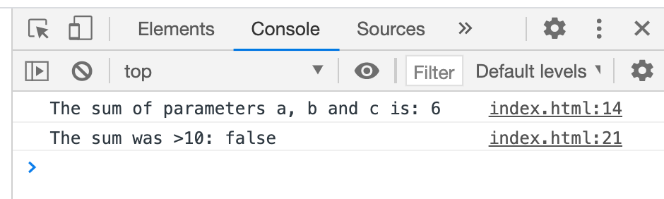

# Assignment: What's the function (WTF)

*PLEASE READ THIS **ENTIRE** DOCUMENT FIRST*

* [the assignment](#the-assignment)
* [submitting-your-work](#submitting-your-work)

## The assignment

Download this repo and edit the Javascript inside `index.html`.

* The function needs to add 3 numbers which are passed along through its parameters
* The function itself has to log the result of the sum to the console ánd return a true or false
* The function only returns true if the result is higher than 10
* In the `console.log` expression, you'll see a technique called [Template Literals](https://developer.mozilla.org/nl/docs/Web/JavaScript/Reference/Template_literals). Just an easy way to put variables along text inside a single line.

Make sure this project works locally.

## Submitting your work
* Create a new branch called **gh-pages** and upload your local work into this branch.
* Start a new **pull request**, select one **reviewer** and make sure to put the **GitHub Pages URL** in the comment section. 
* Do **not** merge this Pull Request yourself. That's up to the reviewer to decide (merging is approving the assignment).
